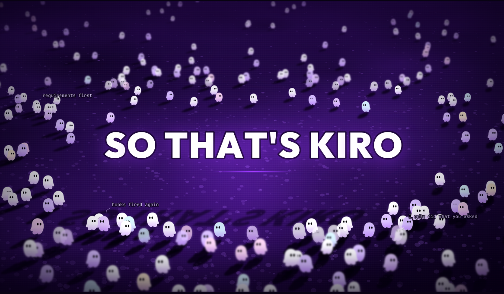
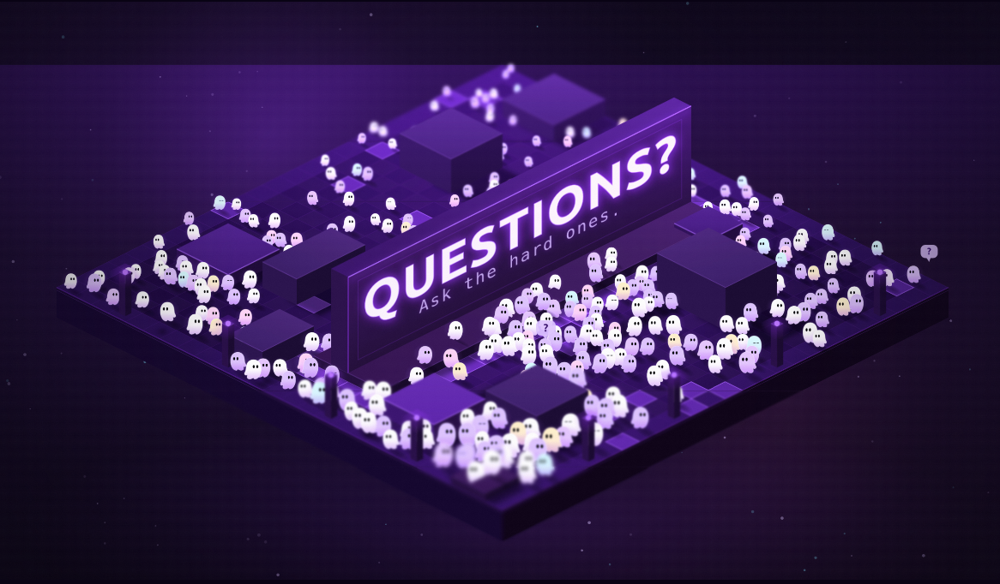

# 2026-09 Kiro Presentation — Outro

> [!WARNING]
> **AI-authored:** This change was autonomously planned and implemented by an AI software factory from a human-authored specification, with possible subsequent human review or modification.

Standalone closing screen for the Kiro presentation.

Tilt-shifted ground plane with tiny Kiro ghosts wandering around a central `SO THAT'S KIRO`. Title occupies a keep-out plaza; crowd paths around it rather than passing behind/under it.

Same basic methodology as Starting Soon:

**`VISION.md` + concrete visual references -> implementation**

Difference: no software factory/orchestration. Direct terminal invocation with spec + references available to the model. Auto-approve / hands-off run.

Trigger was trivial: read the vision, inspect references, build toward it.

Primary visual reference: [Tiny Humans](https://github.com/thesephist/tinyhumans) by Linus. Mainly borrowed the miniature-world composition / strong central text anchor, then adapted that into a keep-out area with a moving crowd.

Also reused CodePen references from Starting Soon for animation / visual vocabulary.

Run produced two variants without me explicitly asking for alternatives. Seems to have branched on its own while running hands-off — although possible I approved something and forgot about it.

| Main Outro                    | Alternative Outro                    |
| ----------------------------- | ------------------------------------ |
|  |  |

## Run

Spin up a local HTTP server:

```sh
python3 -m http.server 8080
```

Open `http://localhost:8080/`.

## Notes

- Tiny Humans is the main design anchor. Its characters don't move around the text, but the miniature crowd + strong central type is basically the visual seed for this.
- Kiro silhouette has a practical minimum size. Too small and the eyes merge into the body; stops reading as Kiro.
- Model independently added Kiro-specific text headers. Not part of the original direction.
- Crowd density matters more than raw count. Too dense = patterned wallpaper instead of miniature world.
- Colour variance needed restraint. Slight tint works; strong Kiro accent colours make the ghosts look toy-ish.
- Making `SO THAT'S KIRO` occupy physical space was probably the key composition choice. Crowd paths around it, so the title reads as part of the world rather than an overlay.
- Tilt-shift does a lot of work. Without it: lots of small sprites. With it: miniature physical space.
- Useful comparison with Starting Soon: both driven by detailed spec + concrete references, but this one skipped the factory entirely.
- Another data point for the current hypothesis: cohesive visual work may care more about spec + reference quality than orchestration/task decomposition.
